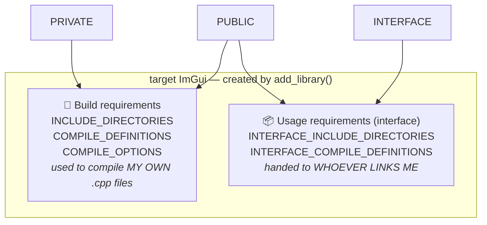
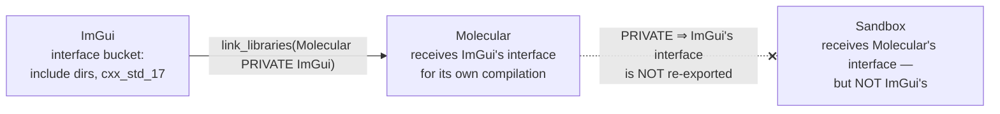
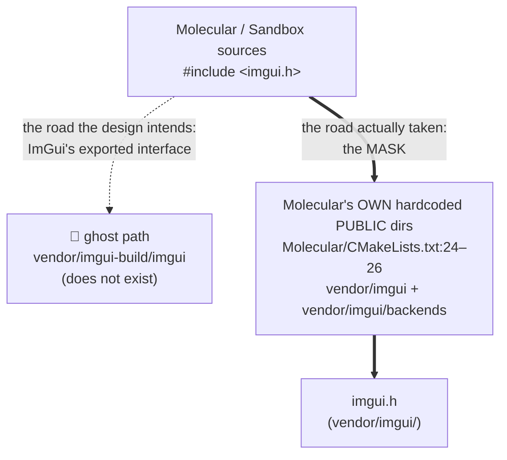

# 🎨 CMake targets: the two buckets, and how properties travel

Written mid-exercise-003, when `target_include_directories` kept "working" no
matter what string was passed to it. This page gives you the model that makes
the exercise obvious. Read it fully before touching the file again.

## The wrong model (the one you're using)

> "CMake looks at my project, sees that Sandbox uses ImGui, and figures out the
> include paths."

No. CMake never *figures out* anything. A `CMakeLists.txt` is an **imperative
script**, executed top to bottom — you already met this when
`target_include_directories` ran before `add_library` existed. Every command
does exactly one dumb thing: it **writes strings into property lists on a
target object**. If you write a nonsense string, CMake stores the nonsense,
generates a build that contains the nonsense, and never once checks whether
the path exists.

## A target is a bag of properties — in two buckets

When `add_library(ImGui STATIC ...)` executes, CMake creates an object named
`ImGui`. Every `target_*` command afterwards writes into one (or both) of two
buckets on that object:



The keyword you pass is nothing more than a bucket selector:

| Keyword | My own compilation | My consumers' compilation |
| --- | --- | --- |
| `PRIVATE` | ✅ | — |
| `INTERFACE` | — | ✅ |
| `PUBLIC` | ✅ | ✅ |

!!! note "You already used this — in 002"
    Making `MOL_ASSETS_DIR` `PRIVATE` meant: *into Molecular's build bucket
    only, invisible to Sandbox*. Compiler-enforced, remember? Same machinery,
    same keyword, different property. Include directories are not special.

## `target_link_libraries` is where buckets travel

`target_link_libraries(Molecular PRIVATE ImGui)` does **two** things:

1. Links `ImGui.lib` into the final binary (the part everyone knows).
2. **Applies everything in ImGui's interface bucket to Molecular's build** —
   include dirs, definitions, compile features. This is the delivery truck.

And the keyword on the *link* decides whether the delivery is passed on:



- `PRIVATE` link — Molecular consumes ImGui's interface for itself; the chain
  **stops**. Sandbox sees nothing of ImGui.
- `PUBLIC` link — Molecular consumes it **and** re-exports it; Sandbox, which
  links Molecular, inherits ImGui's interface transitively.

!!! question "Trace it — this is the stretch goal"
    `Sandbox.cpp:7` includes `imgui.h` directly, and
    `Molecular/CMakeLists.txt:33` links ImGui `PRIVATE`. Once the mask (below)
    is gone, walk the chain: how does ImGui's include path reach Sandbox?
    Either the link keyword changes, or Sandbox links ImGui itself. Decide
    deliberately and be able to defend the choice.

## Relative paths resolve against *this* `CMakeLists.txt`

The rule, verbatim from CMake's behavior: a non-absolute path given to
`target_include_directories` is made absolute **against
`CMAKE_CURRENT_SOURCE_DIR`** — the directory of the `CMakeLists.txt` currently
executing. It is a *path*, never a *name* that CMake looks up somewhere.

```text
Molecular/vendor/
├── imgui/                  ← the submodule; imgui.h LIVES here
│   ├── imgui.h
│   ├── imgui.cpp
│   └── backends/
└── imgui-build/            ← CMAKE_CURRENT_SOURCE_DIR for YOUR file
    └── CMakeLists.txt
```

Your two attempts so far, resolved by that rule:

| You wrote | CMake stored | Exists? |
| --- | --- | --- |
| `imgui-build` | `…/vendor/imgui-build/imgui-build` | ❌ |
| `imgui` | `…/vendor/imgui-build/imgui` | ❌ |

Neither string was ever *looked up* — each was just glued onto the current
directory. To reach a **sibling** directory you go up one level first, exactly
as in a shell: `..`. The idiomatic, self-documenting spelling is
`${CMAKE_CURRENT_SOURCE_DIR}/../imgui`. Your source list already knows this —
look at how *it* reaches the `.cpp` files.

## Why nothing failed: three accidents masking the bug

The uncomfortable part: with a nonexistent exported include path, everything
configured, compiled, and linked. Three independent accidents conspired.



1. **MSVC doesn't care.** A `/I` directory that doesn't exist is silently
   skipped. No warning, nothing.
2. **ImGui's own sources never needed the property.** `imgui.cpp` says
   `#include "imgui.h"` — the *quote* form searches the including file's own
   directory **first**. The submodule's sources sit next to their headers, so
   the library compiles with zero include directories at all.
3. **The consumers were being served by someone else.** `Molecular` hardcodes
   `vendor/imgui` and `vendor/imgui/backends` into **its own** `PUBLIC`
   include dirs. The consumer is paying a debt the owner should export. That
   is exactly what the spec means by *"include paths don't travel with the
   target"* — and why the stretch goal deletes those lines to **prove** the
   export works.

!!! warning "Green is evidence, not proof — again"
    This is 002's drive-relative hole wearing a build-system costume. The
    suite (here: the build) passed while the design was broken, because a
    second mechanism shadowed the first. The only *proof* the export works is
    removing the mask and watching it still build.

## See it with your own eyes

The generated project files are the ground truth for what CMake actually
stored. Open `cmake-build-debug-visual-studio/Molecular/Molecular.vcxproj` and
search for `AdditionalIncludeDirectories` — today it contains, verbatim:

```text
D:\...\Molecular\vendor\imgui              ← the mask (Molecular:25)
D:\...\Molecular\vendor\imgui\backends     ← the mask (Molecular:26)
D:\...\Molecular\vendor\imgui-build        ← stale mask entry (Molecular:24)
D:\...\Molecular\vendor\imgui-build\imgui  ← 👻 your ghost, baked in
```

The ghost travels the whole pipeline — property list → generator → vcxproj →
`cl.exe` command line — and only survives because the compiler shrugs at it.

A configure-time probe you can drop (temporarily) at the *end* of the root
`CMakeLists.txt` whenever you want to interrogate a target:

```cmake
get_target_property(_dirs ImGui INTERFACE_INCLUDE_DIRECTORIES)
message(STATUS "ImGui exports: ${_dirs}")
```

!!! info "Stale twins in the build directory"
    `cmake-build-debug-visual-studio/Molecular/vendor/imgui/ImGui.vcxproj`
    still exists — a leftover from before the rename, no longer referenced by
    the solution. Generated build dirs accumulate corpses; when in doubt,
    delete the build dir and reconfigure from scratch.

## Aside: multi-config generators and your output-dir block

Visual Studio is a **multi-config** generator: Debug/Release is chosen at
*build* time, so at configure time `CMAKE_BUILD_TYPE` is **empty**. Your

```cmake
ARCHIVE_OUTPUT_DIRECTORY "${CMAKE_BINARY_DIR}/bin/${CMAKE_BUILD_TYPE}/${PROJECT_NAME}"
```

expands to `bin//ImGui` → `bin/ImGui`, and MSBuild then appends its own
per-config folder. That is why `ImGui.lib` landed in `bin/ImGui/Debug/` while
every other library went where the **root's** global output settings put them
(`bin-int/.../Debug/`). The block duplicates — incorrectly — something the
root already owns. Spec requirement 4's spirit applies: if it buys nothing,
it's not minimalism to keep it, it's clutter. Delete it.

## Back to 003 — the questions your file must answer

- [ ] Does every path you export **exist**? Prove it in the vcxproj or with
      the probe — don't guess strings.
- [ ] After the fix, the **owner** (`ImGui`) exports its headers. What happens
      to the mask at `Molecular/CMakeLists.txt:24–26`? (Backends nuance:
      `ImGuiBuild.cpp` compiles the impl files *inside Molecular*, so decide
      which target needs `backends/` and in **which bucket**.)
- [ ] Trace `Sandbox.cpp:7` through the link keywords with the mask gone —
      does the `PRIVATE` at `Molecular/CMakeLists.txt:33` still hold?
- [ ] `imgui_demo.cpp`: dropping it is defensible — the only
      `ShowDemoWindow` call in the codebase is commented out
      (`ImGuiLayer.cpp:68`) — but the spec wants the decision **written
      down** as a one-line comment.
- [ ] The `set_target_properties` block: what does it buy under a
      multi-config generator? (See the aside.)
- [ ] `WINDOWS` compile definition: grep the imgui sources for it. A define
      nothing reads is dead weight.

Then, and only then: the fresh-clone acceptance run in
[the 003 spec](../exercises/003-imgui-build-fix.md).