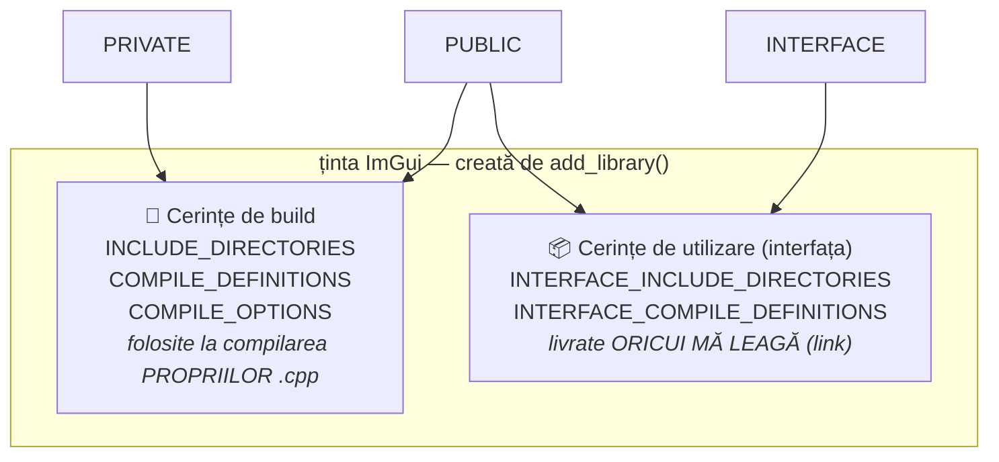
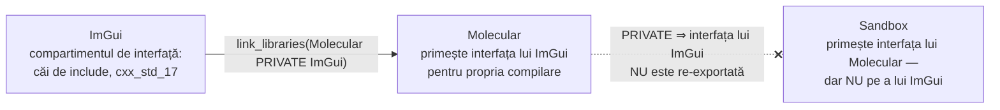
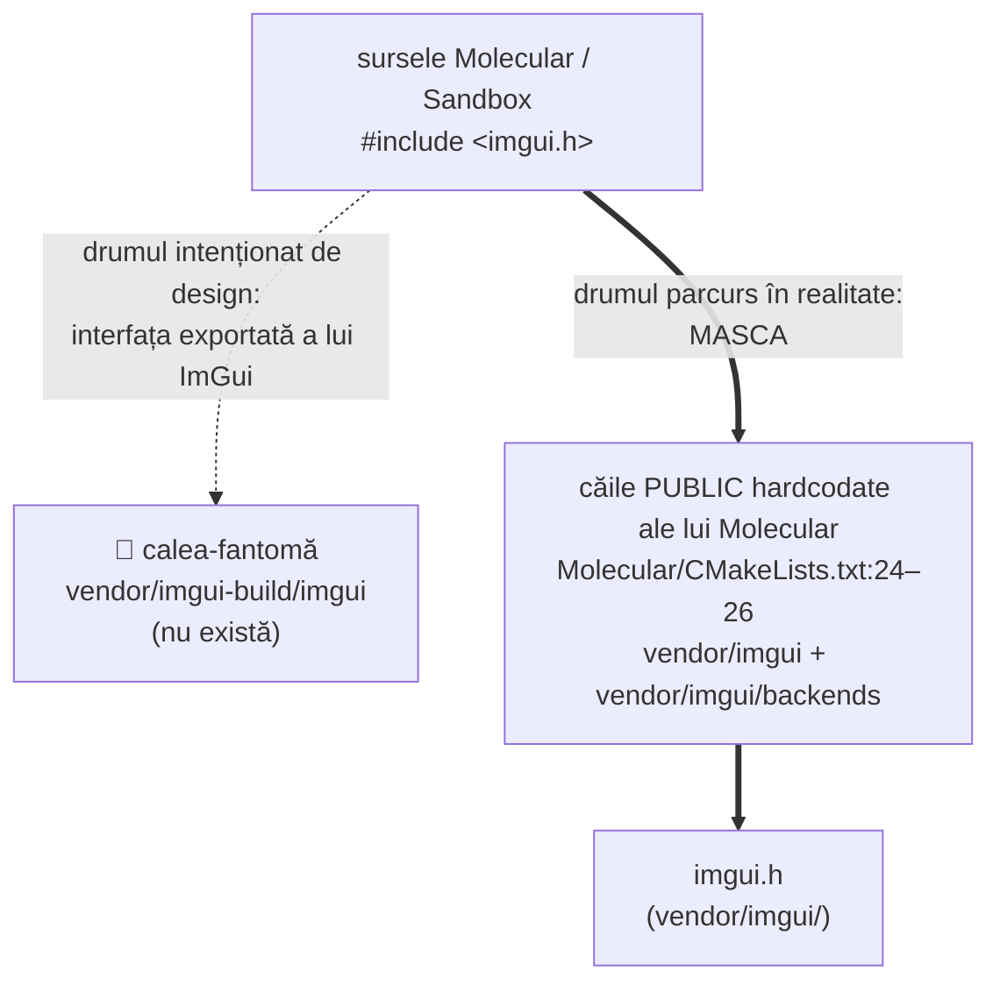

# 🎨 Ținte CMake: cele două compartimente și cum circulă proprietățile

Scrisă în mijlocul exercițiului 003, când `target_include_directories`
„mergea" indiferent ce șir primea. Pagina asta îți dă modelul mental care face
exercițiul evident. Citește-o integral înainte să mai atingi fișierul.

## Modelul greșit (cel pe care îl folosești acum)

> „CMake se uită la proiect, vede că Sandbox folosește ImGui și își dă seama
> singur de căile de include."

Nu. CMake nu *își dă seama* de nimic. Un `CMakeLists.txt` este un **script
imperativ**, executat de sus în jos — ai întâlnit deja asta când
`target_include_directories` a rulat înainte ca `add_library` să existe.
Fiecare comandă face exact un lucru simplu: **scrie șiruri de caractere în
listele de proprietăți ale unui obiect-țintă**. Dacă scrii un șir fără sens,
CMake stochează nonsensul, generează un build care conține nonsensul și nu
verifică niciodată dacă acea cale există.

## O țintă este un sac de proprietăți — în două compartimente

Când se execută `add_library(ImGui STATIC ...)`, CMake creează un obiect numit
`ImGui`. Fiecare comandă `target_*` de după scrie într-unul (sau ambele) din
cele două compartimente (*buckets*) ale obiectului:



Cuvântul-cheie pe care îl pasezi nu e nimic mai mult decât un selector de
compartiment:

| Cuvânt-cheie | Compilarea mea | Compilarea consumatorilor mei |
| --- | --- | --- |
| `PRIVATE` | ✅ | — |
| `INTERFACE` | — | ✅ |
| `PUBLIC` | ✅ | ✅ |

!!! note "Ai folosit deja mecanismul — în 002"
    `MOL_ASSETS_DIR` pe `PRIVATE` a însemnat: *doar în compartimentul de build
    al lui Molecular, invizibil pentru Sandbox*. Impus de compilator, mai știi?
    Aceeași mașinărie, același cuvânt-cheie, altă proprietate. Directoarele de
    include nu sunt un caz special.

## `target_link_libraries` este locul unde compartimentele circulă

`target_link_libraries(Molecular PRIVATE ImGui)` face **două** lucruri:

1. Leagă `ImGui.lib` în binarul final (partea pe care o știe toată lumea).
2. **Aplică tot ce e în compartimentul de interfață al lui ImGui asupra
   build-ului lui Molecular** — directoare de include, definiții, compile
   features. Acesta e camionul de livrare.

Iar cuvântul-cheie de pe *link* decide dacă livrarea merge mai departe:



- Link `PRIVATE` — Molecular consumă interfața lui ImGui pentru el însuși;
  lanțul **se oprește**. Sandbox nu vede nimic din ImGui.
- Link `PUBLIC` — Molecular o consumă **și** o re-exportă; Sandbox, care
  leagă Molecular, moștenește tranzitiv interfața lui ImGui.

!!! question "Urmărește lanțul — acesta e obiectivul stretch"
    `Sandbox.cpp:7` include `imgui.h` direct, iar
    `Molecular/CMakeLists.txt:33` leagă ImGui cu `PRIVATE`. După ce masca (mai
    jos) dispare, parcurge lanțul: cum ajunge calea de include a lui ImGui la
    Sandbox? Ori se schimbă cuvântul-cheie de pe link, ori Sandbox leagă ImGui
    el însuși. Decide deliberat și fii capabil să aperi alegerea.

## Căile relative se rezolvă față de *acest* `CMakeLists.txt`

Regula, exact cum se comportă CMake: o cale ne-absolută dată lui
`target_include_directories` este transformată în cale absolută **față de
`CMAKE_CURRENT_SOURCE_DIR`** — directorul fișierului `CMakeLists.txt` aflat în
execuție. Este o *cale*, niciodată un *nume* pe care CMake l-ar căuta undeva.

```text
Molecular/vendor/
├── imgui/                  ← submodulul; imgui.h TRĂIEȘTE aici
│   ├── imgui.h
│   ├── imgui.cpp
│   └── backends/
└── imgui-build/            ← CMAKE_CURRENT_SOURCE_DIR pentru fișierul TĂU
    └── CMakeLists.txt
```

Cele două încercări ale tale de până acum, rezolvate prin regula de mai sus:

| Ai scris | CMake a stocat | Există? |
| --- | --- | --- |
| `imgui-build` | `…/vendor/imgui-build/imgui-build` | ❌ |
| `imgui` | `…/vendor/imgui-build/imgui` | ❌ |

Niciun șir nu a fost vreodată *căutat* — fiecare a fost pur și simplu lipit de
directorul curent. Ca să ajungi la un director **frate** urci mai întâi un
nivel, exact ca într-un shell: `..`. Forma idiomatică, auto-documentată, este
`${CMAKE_CURRENT_SOURCE_DIR}/../imgui`. Lista ta de surse știe deja asta —
uită-te cum ajunge *ea* la fișierele `.cpp`.

## De ce nu a eșuat nimic: trei accidente care maschează bug-ul

Partea incomodă: cu o cale de include exportată inexistentă, totul s-a
configurat, compilat și legat. Trei accidente independente au conspirat.



1. **MSVC nu se plânge.** Un director `/I` care nu există este sărit în
   tăcere. Niciun warning, nimic.
2. **Sursele lui ImGui n-au avut niciodată nevoie de proprietate.**
   `imgui.cpp` spune `#include "imgui.h"` — forma cu *ghilimele* caută mai
   întâi în directorul fișierului care include. Sursele submodulului stau
   lângă propriile headere, deci biblioteca se compilează cu zero directoare
   de include.
3. **Consumatorii erau serviți de altcineva.** `Molecular` hardcodează
   `vendor/imgui` și `vendor/imgui/backends` în **propriile** directoare
   `PUBLIC`. Consumatorul plătește o datorie pe care proprietarul ar trebui
   s-o exporte. Exact asta înseamnă în spec *„căile de include nu călătoresc
   cu ținta"* — și de aceea obiectivul stretch șterge acele linii, ca să
   **demonstreze** că exportul funcționează.

!!! warning "Verde e o dovadă circumstanțială, nu o demonstrație — din nou"
    Aceasta e gaura drive-relative din 002, costumată în build system. Suita
    (aici: build-ul) a trecut în timp ce designul era stricat, pentru că un al
    doilea mecanism îl umbrea pe primul. Singura *demonstrație* că exportul
    funcționează este să scoți masca și să vezi că totul încă se compilează.

## Vezi cu ochii tăi

Fișierele de proiect generate sunt adevărul-teren despre ce a stocat CMake.
Deschide `cmake-build-debug-visual-studio/Molecular/Molecular.vcxproj` și
caută `AdditionalIncludeDirectories` — azi conține, textual:

```text
D:\...\Molecular\vendor\imgui              ← masca (Molecular:25)
D:\...\Molecular\vendor\imgui\backends     ← masca (Molecular:26)
D:\...\Molecular\vendor\imgui-build        ← intrare de mască rămasă (Molecular:24)
D:\...\Molecular\vendor\imgui-build\imgui  ← 👻 fantoma ta, copiată ca atare
```

Fantoma străbate întregul lanț — listă de proprietăți → generator → vcxproj →
linia de comandă `cl.exe` — și supraviețuiește doar pentru că compilatorul
ridică din umeri.

O sondă la configurare, pe care o poți pune (temporar) la *sfârșitul*
`CMakeLists.txt`-ului rădăcină oricând vrei să interoghezi o țintă:

```cmake
get_target_property(_dirs ImGui INTERFACE_INCLUDE_DIRECTORIES)
message(STATUS "ImGui exports: ${_dirs}")
```

!!! info "Gemeni-fantomă în directorul de build"
    `cmake-build-debug-visual-studio/Molecular/vendor/imgui/ImGui.vcxproj`
    încă există — o rămășiță de dinainte de redenumire, nereferențiată de
    soluție. Directoarele de build generate acumulează cadavre; când ai
    dubii, șterge directorul de build și reconfigurează de la zero.

## Paranteză: generatoare multi-config și blocul tău de output

Visual Studio este un generator **multi-config**: Debug/Release se alege la
*build*, deci la configurare `CMAKE_BUILD_TYPE` este **gol**. Al tău

```cmake
ARCHIVE_OUTPUT_DIRECTORY "${CMAKE_BINARY_DIR}/bin/${CMAKE_BUILD_TYPE}/${PROJECT_NAME}"
```

se expandează în `bin//ImGui` → `bin/ImGui`, iar MSBuild adaugă apoi propriul
folder per-config. De aceea `ImGui.lib` a aterizat în `bin/ImGui/Debug/`, în
timp ce toate celelalte biblioteci au mers unde le-au pus setările globale ale
**rădăcinii** (`bin-int/.../Debug/`). Blocul duplică — incorect — ceva ce
rădăcina deja deține. Se aplică spiritul cerinței 4 din spec: dacă nu aduce
nimic, a-l păstra nu e minimalism, e dezordine. Șterge-l.

## Înapoi la 003 — întrebările la care fișierul tău trebuie să răspundă

- [ ] **Există** fiecare cale pe care o exporți? Demonstrează în vcxproj sau
      cu sonda — nu ghici șiruri.
- [ ] După fix, **proprietarul** (`ImGui`) își exportă headerele. Ce se
      întâmplă cu masca de la `Molecular/CMakeLists.txt:24–26`? (Nuanța
      backends: `ImGuiBuild.cpp` compilează fișierele impl *în interiorul
      lui Molecular*, deci decide care țintă are nevoie de `backends/` și în
      **care compartiment**.)
- [ ] Urmărește `Sandbox.cpp:7` prin cuvintele-cheie de link, cu masca
      scoasă — mai rezistă `PRIVATE`-ul de la `Molecular/CMakeLists.txt:33`?
- [ ] `imgui_demo.cpp`: eliminarea e apărabilă — singurul apel
      `ShowDemoWindow` din codebase e comentat (`ImGuiLayer.cpp:68`) — dar
      spec-ul cere ca decizia să fie **scrisă**, într-un comentariu de un
      rând.
- [ ] Blocul `set_target_properties`: ce aduce sub un generator multi-config?
      (Vezi paranteza.)
- [ ] Definiția `WINDOWS`: caută cu grep prin sursele imgui. O definiție pe
      care n-o citește nimeni e greutate moartă.

Apoi, și doar apoi: rularea de acceptare cu clona proaspătă din
[spec-ul 003](../exercises/003-imgui-build-fix.md).